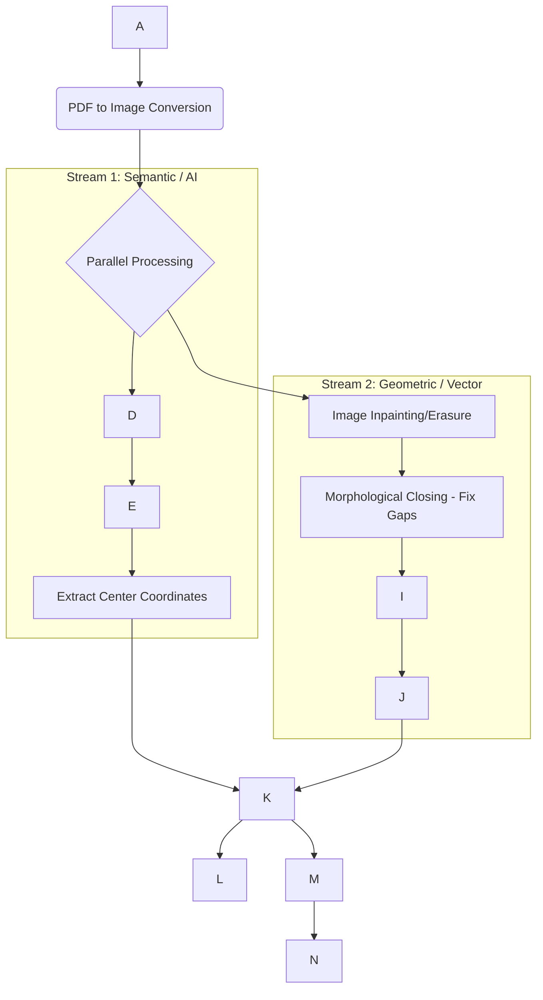

Based on your goal to automate **MEP, Alarm, and Low Voltage (LV) as-builts** and fix the "disjoint geometry" problem, here is the optimal Application Overview and Technology Stack.

This architecture moves away from simple "image tracing" (which causes the broken circles you are seeing) and adopts a **Hybrid Semantic-Geometric Pipeline**.

---

### 1. Application Overview: The "Hybrid" Pipeline

To solve the issue where circles and lines are broken/disjointed, the application must treat them differently. You cannot use a single algorithm for the whole image. The application will split the image into two processing streams: **Objects (Symbols)** and **Connections (Wires/Lines)**.

#### **Phase A: Input & Pre-processing**

* **Input:** Multi-page PDF or Raster Images (TIFF/PNG) of As-Built Plans.
* **Conditioning:** The app cleans the "noisy" scan. It creates a binary (black/white) version and uses **Morphological Closing** to physically connect the pixel gaps in your disjointed circles *before* any vectorization happens.

#### **Phase B: The "Symbol" Stream (AI-Driven)**

* *Solves: "Comprehends the shape and size"*
* Instead of tracing a Fire Alarm strobe or a Valve pixel-by-pixel (which creates jagged lines), the app uses an AI model (**YOLO**) to "look" at the drawing.
* It identifies: "There is a **Circular Pump** at `x:100, y:200` with `radius:50`."
* **Action:** It records the coordinate and type, then **erases** the pixels of that symbol from the image so the line-tracer doesn't get confused by them.

#### **Phase C: The "Geometry" Stream (Algorithmic)**

* *Solves: "Vector geometries"*
* The app takes the remaining image (just wires, pipes, and walls) and performs **Skeletonization**. This reduces thick lines to single-pixel centerlines (perfect for wiring diagrams).
* **Topology Engine:** It converts these pixels into a mathematical **Graph (Nodes & Edges)**. It identifies broken segments (nodes with only 1 connection) and "heals" them by merging them with the nearest neighbor.

#### **Phase D: The "Assembly" (CAD Generation)**

* The app creates a new `.dxf` or `.dwg` file.
* **Layer 1 (Symbols):** It inserts pre-made, clean AutoCAD Blocks (e.g., `block_valve.dwg`) at the coordinates found in Phase B.
* **Layer 2 (Wiring):** It draws the healed lines from Phase C on the appropriate layers (e.g., `E-WIRING`, `M-PIPING`).

---

### 2. Technology Stack

This stack is entirely Python-based, utilizing open-source libraries that are standard in the Computer Vision and CAD automation industry.

#### **Core Backend (Python)**

| Component | Tech / Library | Role in your App |
| --- | --- | --- |
| **Orchestration** | **Python 3.10+** | The glue code connecting AI, Image Processing, and CAD generation. |
| **PDF Handling** | **`pdf2image`** (with Poppler) | Converts high-res PDF plans into 300+ DPI images for processing. |
| **CAD I/O** | **`ezdxf`** | **Critical.** Reads/Writes `.dxf` files. Allows you to create Layers, insert Blocks, and draw Polylines programmatically. |

#### **Computer Vision & AI (The "Brain")**

| Component | Tech / Library | Role in your App |
| --- | --- | --- |
| **Image Processing** | **OpenCV (`cv2`)** | Handles "Morphological Closing" to fix the pixel gaps in your screenshot. Used for noise removal and thresholding. |
| **Symbol Detection** | **YOLOv8** (Ultralytics) | **The AI Model.** You will train this to recognize your specific MEP symbols (Valves, Strobes, Panels). It is faster and more accurate than older methods. |
| **Shape Fitting** | **`scikit-image`** | Specifically `hough_circle_peaks` for detecting perfect circles (like your reference image) without training an AI model. |

#### **Vectorization & Topology (The "Engine")**

| Component | Tech / Library | Role in your App |
| --- | --- | --- |
| **Skeletonization** | **`scikit-image`** | `morphology.skeletonize` turns thick pixel lines into 1-pixel wide centerlines (essential for wire/pipe tracing). |
| **Graph Logic** | **NetworkX** | Converts vector lines into a mathematical graph. Allows you to write logic like: *"If this line ends 2 pixels away from that line, merge them."* |
| **Simplification** | **`visvalingam-wyatt`** | Simplifies the massive amount of vertices generated by scanning, ensuring the final CAD file is lightweight. |

---

### 3. Data Flow Diagram

### 4. Why This Solves Your "Disjoint" Problem

1. **Morphological Closing (Step H):** Physically connects the white pixels in the image before the computer tries to trace them.
2. **YOLO/Hough (Step D):** Instead of trying to trace a "circle" as 20 jagged lines, it detects it as a "Circle Object" and draws a mathematically perfect circle in the CAD file.
3. **NetworkX (Step J):** Systematically finds "dangling" line ends and snaps them together, ensuring your wiring diagrams are electrically valid circuits, not just lines on a page.